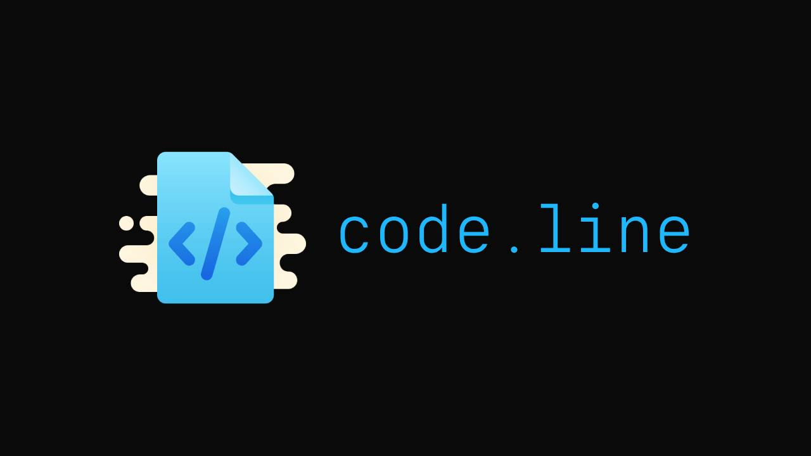

# code.line 📝

**code.line** is a simple minimalist web app to create, save, and view syntax-highlighted code snippets. It supports automatic language detection and presents code beautifully with Highlight.js.

[Try it out yourself here!](https://codeline.iamsky.hackclub.app)

---



---

## Features ✨

* Create new code snippets with a title and code content.
* Automatically detect syntax language based on file extension in the title (e.g. `.py`, `.js`, `.html`).
* View saved snippets with syntax highlighting using Highlight.js dark theme.
* Unique snippet URLs generated securely with random IDs.
* Minimal dependencies and easy to run locally.

---

## Installation 📦

1. Clone the repository:

   ```bash
   git clone https://github.com/c2y5/code.line.git
   cd code.line
   ```

2. Install dependencies:

   ```bash
   pip install -r requirements.txt
    ```

---

## Usage 🚀

Run the app locally:

```bash
python app.py
```

Open your browser at `http://localhost:5000` to create and view code snippets.

---

## How it works 🔍

* Submit a snippet via the form on the homepage by providing a **title** and **code**.
* The app saves the snippet as a text file with a generated random ID.
* Viewing a snippet URL (e.g. `/a1b2c3d4e5f6g7h8`) reads the file and parses the title and code.
* The file extension in the title determines the syntax highlighting language.
* The snippet code is rendered inside a styled page with Highlight.js.

---

## Project Structure 📂

```
code.line/
├── snippets/                   # Folder where snippets are stored as text files (will be auto created)
├── static/
│   ├── favicon.png             # Favicon of the website
│   ├── GraviticaMono.otf       # Gravitica Mono font
│   └── style.css               # Custom CSS styles
├── templates/
│   ├── index.html              # Homepage with snippet submission form
│   └── view.html               # Snippet display page with syntax highlighting
├── app.py                      # Flask app main script
└── README.md                   # Project README file
```

---

## Dependencies 🔨

* [Python 3.10+](https://python.org)
* `Flask`
* `gunicorn`

---

## License 📄

This project is licensed under the MIT License — see the [LICENSE](./LICENSE) file for details.

---

## Contributing 🤝

Feel free to submit issues or pull requests! Suggestions to improve code.line are very welcome.

---
